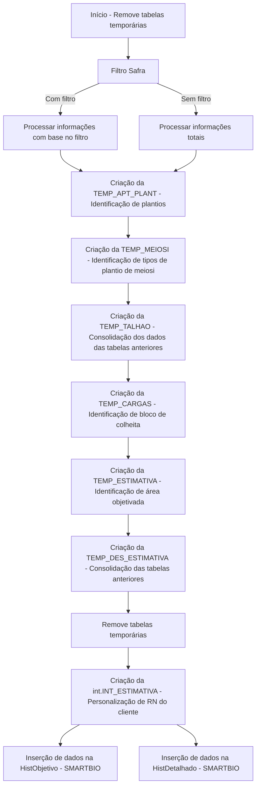

## DOC_SP_DES_INT_ESTIMATIVA PIMS

## Interface SP_DES_INT_ESTIMATIVA

## Consolidação de dados de produção de cana do ERP PIMS

## Módulo Estimativa

### Índice

- [Identificação](#identificação)
- [Resumo do Processo](#resumo-do-processo)
- [Requisitos](#requisitos)
- [Fluxograma de Processamento](#fluxograma-de-processamento)
- [Fluxo descritivo e detalhado da interface](#fluxo-descritivo-e-detalhado-da-interface)
- [Descrição da Fonte de Dados](#descrição-da-fonte-de-dados)
- [Campos de Dados](#campos-de-dados)
- [Exemplo de Resultado](#exemplo-de-resultado)

### Identificação

- **Interface:** SP_DES_INT_ESTIMATIVA
- **Nome da RN:** DOC_SP_DES_INT_ESTIMATIVA PIMS
- **Objetivo:** Consolidação de dados do ERP PIMS relacionados à
  estimativa de produção de cana por safra e talhão.
- **Impacto:** A estimativa de produção impacta planejamento, gestão
  de recursos, estratégias comerciais e políticas públicas.
- **Responsável:** Agro / Integração
- **Data Criação:** 25/08/2025

### Resumo do Processo

O processo é feito através do acesso ao dados das tabelas essencias, com o acesso é feito a montagem da consolidação dos dados para identificação de safras, tipos de plantio, identificação de áreas objetivadas, e áreas alocadas em bloco de colheita.

Seguindo filtros pré acordados, que podem incluir a coleta de informações a partir de uma safra, ignorar blocos, caso o cliente não use, são identificadas todas as safras dos talhões que estão estimados.

O processo utiliza tabelas temporárias para fazer os cálculos de TCH, somas de
áreas, identificação de plantio mais recente e etc.

Após isso, uma tabela consolidada é criada em nosso banco chamada `int.TEMP_DES_ESTIMATIVA`, fazendo uso dos dados contidos nela, é alimentado as tabelas do Smartbio, `HistObjetivo` e `HistDetalhado`.

### Requisitos

A identificação de talhões e safras a serem estimados ocorre quando o cliente faz a objetivação de objetiva a safra no PIMS e insere o talhão em um **bloco de colheita**.

- Dentro da tabela `HISTPREPRO` buscamos tudo que esta objetivado, considerando o campo `CD_HIST ≠ 'E'`.
- O **bloco de colheita** é identificado na tabela `APT_CARGAS_LOC`, se o talhão estiver idenficado num bloco de colheita, terá um código no campo `NO_LIBERACAO`.

### Fluxograma de Processamento



### Fluxo descritivo e detalhado da interface

**1. Início de processamento**
O procedimento inicial da interface, é fazer a limpeza inicial, para remover qualquer dados que possam conter em cache de execuções anteriores, é feito isso para todas as tabelas temporárias a serem usadas. Isso garante que não haja dados residuais que prejudiquem a execução atual.

- **1.1 Filtros gerais**
  Dentre os filtros gerais, temos as variáveis, que são determinadas conforme acordo com o cliente para identificar que apartir daquele parâmeratro, serão considerados as informações coletadas.
  A identificação dessas variáveis ocorre através das funções que consome os mapeamentos aprovados como parâmetros.

  - **Variável de bloco:**
    Indica se o nível de detalhe do bloco deve ser ignorado (1) ou não (0). Ao usar essa variável ativamente, é verficado os dados a níveis de fazenda e talhão apenas.

  ```sql
  SELECT @IGNORA_BLOCO = /*BancoPrincipal*/.int.FN_RETORNA_MAPEAMENTO('IGNORA_BLOCO','IGNORA_BLOCO')
  ```

  - **Variável de Safra:**
    Usada pra indicar a safra mínima a ser considerada, então a partir deste parâmetro será coletado, caso não, abrangerá todas as safras cadastradas.

  ```sql
  SELECT @FILTRO_CD_SAFRA = ISNULL(/*BancoPrincipal*/.int.FN_RETORNA_MAPEAMENTO('FILTRO_CD_SAFRA','FILTRO_CD_SAFRA'),0)
  ```

  Nos demais filtros gerais, temos os essenciais para identificação de safras estimadas.

  - **Objetivação de safra**
    A identificação principal para uma safra e talhão serem estimados são encontrados a partir deste parâmetro.
    Onde na tabela `HISTPREPRO` identificamos todas as safras que foram definidas para serem estimadas no ERP PIMS, a partir do parâmetro `CD_HIST ≠ 'E'`.

  - **Bloco de Colheita**
    Identificação do bloco de colheita que foi alocado a uma área estimada, necessário esse parâmetro para objetivação de safra.
    O bloco é encontrado dentro da tabela `APT_CARGAS_LOC`.

- **1.2 Filtros de campos**

  - **SE_HISTDETALHADO**
    Chave integrada que identifica unicamente o talhão para uso de rastreabilidade e etc.
  - **Bloco de Colheita**
    Código de liberação de agrupamento para colheita do talhão.
    Campo: `NO_LIBERACAO` - Tabela: `APT_CARGAS_LOC`
  - **Plantio**
    - Para plantio comum usamos a mais recente **DT_PLANTIO** da safra contida na tabela `APT_PLANT_HE`.
    - Em segunda opção temos a data de plantio da tabela `UPNIVEL3` ou no caso de plantio de meiosi é usado o campo `DT_PLANTIOMEIOSI` na tabela `APT_PLANT_HE` usando filtro no campo `DE_SIST_PLAN`.
  - **Área Plantada**:
    - Agrupamos por safra, fazenda, bloco e talhão.
      Então é feito a soma `QT_AREA` da tabela `APT_PLANT_HE`, considerando a data mais recente e também a média de data de plantio `DT_PLANTIO`.
  - **Reforma**:
    - Considerar apenas ocorrências de reforma, usando o filtro de campo `FG_OCORREN = 'R'` da tabela `SAFRUPNIV3`.
    - Trazendo sempre a ocorrência mais recente por talhão e safra.
  - **Destino plantio**
    - A estimativa final é classificada em:
      - **Muda** que refere se ao campo `CD_HIST`=(_igual_) `'S'` da tabela `HISTPREPRO`
      - **Moagem** que refere se ao campo `CD_HIST` !=(_diferente_) `'S'` da tabela `HISTPREPRO`.
        _Lembrando que **NÃO** integramos áreas onde o campo **CD_HIST** = 'E' pois são canas de produção._

**2. Tabelas temporárias**

Criação da `TEMP_UPNV3`, que busca dados básicos de safras existentes do talhão, vindas da `UPNIVEL3`, juntando com informações administrativas (`MODULOADM`, `UNIADM`).

Campos principais: _safra, empresa, níveis hierárquicos, data de plantio, sistema de plantio, área produtiva, estágio, ocupação, propriedade, meiosi e variedade._

Sempre trazendo apenas registros da safra >= **@FILTRO_CD_SAFRA** são incluídos.

Criação da `TEMP_APT_PLANT`, busca dados complementares vindas da `APT_PLANT_HE`, onde seus campos são soma de área plantada `QT_AREA`, data de plantio mais recente `DT_PLANTIO`, a média entre dos os plantios `DT_PLANTIO_MEDIA` para aquela safra, e trazendo sempre o codigo da fazenda, bloco e talhão.

Criação da `TEMP_MEIOSI`, similar ao passo anterior, mas filtrando apenas sistemas de plantio que contenham “MEIO” (meiosi).
Gera soma de área `QT_AREA` e data de plantio `DT_PLANTIOMEIOSI` mais recente de meiosi por talhão.

Criação da `TEMP_REFORMA`, identifica talhões em reforma a partir de `SAFRUPNIV3`:  
Usa ROW NUMBER para pegar apenas a última ocorrência (_ORDER BY MAX(`DT_OCORREN`) DESC_).

Filtra somente eventos de ocorrência com flag 'R' para então todo resultado ter o indicativo de reforma para cada talhão.

Criação da `TEMP_TALHAO`, consolida todas as informações de cada talhão, juntando:  
Base `TEMP_UPNV3`, variedades `VARIEDADES`, estágios (ESTAGIOS e mapeamento de corte), tipo de propriedade `TIPOPROPRI`, indicação de reforma `TEMP_REFORMA`, dados de plantio `TEMP_APT_PLANT`, dados de meiosi `TEMP_MEIOSI`.

Nessa etapa, aplica ISNULL para considerar a data de plantio de `APT_PLANT_HE` quando disponível, ou manter a de `UPNIVEL3` caso contrário.

Criação da `TEMP_CARGAS`, a partir de `APT_CARGAS_LOC`, gera a menor data de liberação por bloco de colheita (MIN(**NO_LIBERACAO**)), agrupando por níveis hierárquicos e safra.

Criação da `TEMP_ESTIMATIVA`, a partir de `HISTPREPRO`, traz dados históricos de estimativas de produção:  
Área objetivo **QT_AREA_PROD**, TCH estimado **QT_TCH**, ocorrência de objetivação **CD_HIST**.

Tipo de objetivo: 'S' → Muda, senão 'Moagem'  
Filtra safra >= @FILTRO_CD_SAFRA e exclui histórico com cana de produção **CD_HIST** = **'E'**.

Criação da `TEMP_DES_ESTIMATIVA`, junta todas as tabelas temporárias anteriores para formar a visão final:

Onde a construção da chave única `SE_HISTDETALHADO` concatenando empresa, ano do plantio, níveis hierárquicos e mapeamento de corte.

Traz dados de bloco de colheita `TEMP_CARGAS` e associa estimativas `TEMP_ESTIMATIVA` ao talhão, usa mapeamento de safra `MapeamentoDados` para interpretar safra como ano.

Então inclui todos os campos consolidados do talhão: variedades, estágio, reforma, meiosi, datas de plantio, áreas, ocupação, etc.

Após todo o processo de criação, remove novamente todas as tabelas temporárias criadas, deixando apenas a `TEMP_DES_ESTIMATIVA` como saída da procedure.

Esse fluxo cria uma visão integrada, limpa e padronizada, pronta para consultas de negócio, cruzando dados de múltiplas origens (plantio, reforma, meiosi, cargas, estimativas e propriedades) em um único ponto de verdade.

### Descrição da Fonte de Dados

A estimativa de produção de cada **talhão** é construída a partir da integração de diferentes fontes:

Tabela Descrição

| Tabela/Fonte      | Descrição                                                                         |
| ----------------- | --------------------------------------------------------------------------------- |
| `APT_PLANT_HE`    | Registro de plantio (área, data de plantio, média de datas)                       |
| `SAFRUPNIV3`      | Ocorrências F, Q, C do talhão                                                     |
| `HISTPREPRO`      | Áreas objetivadas para manejo                                                     |
| `ocortemd_de`     | Identificação e data de colheita de muda                                          |
| `OCORTEMD_HE`     | Área colhida de muda                                                              |
| `SISTPLAN`        | Sistema de plantio (identificação de plantio de meiosi)                           |
| `UPNIVEL3`        | Estrutura do talhão (empresa, safra, área, sistema, variedade, ocupação, plantio) |
| `SISTPLAN`        | Identificação de tipos de plantio                                                 |
| `VARIEDADES`      | Cadastro de variedades de cana                                                    |
| `ESTAGIOS`        | Estágio de corte da cana                                                          |
| `TIPOPROPRI`      | Tipo de propriedade (própria ou terceiros)                                        |
| `APT_CARGAS_LOC`  | Cargas liberadas no bloco para colheita                                           |
| `HISTPREPRO`      | Indentificação de áreas objetivadas (muda, moagem)                                |
| `MapeamentoDados` | Parâmetros internos de corte e ano safra                                          |

### Campos de Dados

A seguir, o detalhamento dos principais campos da desnormalizada **Estimativa**, incluindo sua regra de preenchimento e interpretação.

| Descrição de campos                                              | Fonte: Tabelas PIMS | Campo: Original PIMS    | Campo: Integrado SMARTBIO      | Destino: Tabela Smartbio  | Campo: Destino Smartbio        | Tipo Campo |
| ---------------------------------------------------------------- | ------------------- | ----------------------- | ------------------------------ | ------------------------- | ------------------------------ | ---------- |
| Identificação de áreas objetivadas pelo planejamento de colheita | `APT_CARGAS_LOC`    | **NO_LIBERACAO**        | **BLOCOCOLHEITA**              | `dbo.HistDetalhado`       | **BlocoColheita**              | varchar    |
| Toneladas estimadas por talhão, cálculo já no ERP do cliente     | `HISTPREPRO`        | **QT_TCH**              | **TCHESTIMADO**                | `dbo.HistDetalhado`       | **TCHEstimado**                | real       |
| Tipo de objetivo da estimativa 'S' = Muda / outro = Moagem       | `HISTPREPRO`        | **CD_HIST**             | **TIPOOBJETIVO**               | `dbo.HistDetalhado`       | **Objetivo**                   | varchar    |
| Área objetivo da estimativa                                      | `HISTPREPRO`        | **AREAOBJETIVO**        | **AREAOBJETIVO**               | `dbo.HistObjetivo`        | **AreaObjetivo**               | float      |
| Código de ocorrência da estimativa                               | `HISTPREPRO`        | **OCORRENCIA**          | **OCORRENCIA**                 | `dbo.HistObjetivo`        | **Ocorrencia**                 | varchar    |
| Unidade administrativa                                           | `UPNIVEL3`          | **CD_UNID_ADM**         | **UNIADM_CD_UNID_ADM**         | `int.TEMP_DES_ESTIMATIVA` | **UNIADM_CD_UNID_ADM**         | nvarchar   |
| Safra vinculada ao talhão                                        | `UPNIVEL3`          | **CD_SAFRA**            | **UPNIVEL3_CD_SAFRA**          | `int.TEMP_DES_ESTIMATIVA` | **UPNIVEL3_CD_SAFRA**          | int        |
| Mapeamento para identificação de ano safra                       | `MapeamentoDados`   | **MAPEAMENTO_ANOSAFRA** | **MAPEAMENTO_ANOSAFRA**        | `int.TEMP_DES_ESTIMATIVA` | **MAPEAMENTO_ANOSAFRA**        | varchar    |
| Código da Fazenda                                                | `UPNIVEL3`          | **CD_UPNIVEL1**         | **UPNIVEL3_CD_UPNIVEL1**       | `int.TEMP_DES_ESTIMATIVA` | **UPNIVEL3_CD_UPNIVEL1**       | nvarchar   |
| Código do Bloco                                                  | `UPNIVEL3`          | **CD_UPNIVEL2**         | **UPNIVEL3_CD_UPNIVEL2**       | `int.TEMP_DES_ESTIMATIVA` | **UPNIVEL3_CD_UPNIVEL2**       | nvarchar   |
| Código do talhão                                                 | `UPNIVEL3`          | **CD_UPNIVEL3**         | **UPNIVEL3_CD_UPNIVEL3**       | `int.TEMP_DES_ESTIMATIVA` | **UPNIVEL3_CD_UPNIVEL3**       | nvarchar   |
| Código da empresa                                                | `UPNIVEL3`          | **CD_EMPRESA**          | **EMPRESAS_CD_EMPRESA**        | `int.TEMP_DES_ESTIMATIVA` | **EMPRESAS_CD_EMPRESA**        | nvarchar   |
| Tipo de propriedade                                              | `UPNIVEL3`          | **CD_TP_PROPR**         | **UPNIVEL3_CD_TP_PROPR**       | `int.TEMP_DES_ESTIMATIVA` | **UPNIVEL3_CD_TP_PROPR**       | smallint   |
| Data de plantio real do talhão                                   | `UPNIVEL3`          | **DT_PLANTIO**          | **DT_PLANTIO**                 | `int.TEMP_DES_ESTIMATIVA` | **DT_PLANTIO**                 | datetime   |
| Média de data de plantio                                         | `APT_PLANT_HE`      | **DT_PLANTIO**          | **APT_PLANT_DT_PLANTIO_MEDIA** | `int.TEMP_DES_ESTIMATIVA` | **APT_PLANT_DT_PLANTIO_MEDIA** | datetime   |
| Área plantada registrada                                         | `APT_PLANT_HE`      | **QT_AREA**             | **APT_PLANT_QT_AREA**          | `int.TEMP_DES_ESTIMATIVA` | **APT_PLANT_QT_AREA**          | float      |
| Área produtiva do talhão                                         | `UPNIVEL3`          | **QT_AREA_PROD**        | **UPNIVEL3_QT_AREA_PROD**      | `int.TEMP_DES_ESTIMATIVA` | **UPNIVEL3_QT_AREA_PROD**      | float      |
| Ocupação do talhão                                               | `UPNIVEL3`          | **CD_OCUP**             | **UPNIVEL3_CD_OCUP**           | `int.TEMP_DES_ESTIMATIVA` | **UPNIVEL3_CD_OCUP**           | smallint   |
| Indicador de propriedade de terceiros                            | `TIPOPROPRI`        | **FG_PROP_TERC**        | **TIPOPROPR_FG_PROP_TERC**     | `int.TEMP_DES_ESTIMATIVA` | **TIPOPROPR_FG_PROP_TERC**     | nvarchar   |
| Data de plantio do talhão                                        | `UPNIVEL3`          | **DT_PLANTIO**          | **UPNIVEL3_DT_PLANTIO**        | `int.TEMP_DES_ESTIMATIVA` | **UPNIVEL3_DT_PLANTIO**        | datetime   |
| Data do plantio na tabela APT_PLANT_HE                           | `APT_PLANT_HE`      | **DT_PLANTIO**          | **APT_PLANT_HE_DT_PLANTIO**    | `int.TEMP_DES_ESTIMATIVA` | **APT_PLANT_HE_DT_PLANTIO**    | datetime   |
| Descrição do estágio de corte                                    | `ESTAGIOS`          | **DE_ESTAGIO**          | **ESTAGIOS_DE_ESTAGIO**        | `int.TEMP_DES_ESTIMATIVA` | **ESTAGIOS_DE_ESTAGIO**        | nvarchar   |
| Código da variedade                                              | `VARIEDADES`        | **CD_VARIED**           | **VARIEDADES_CD_VARIED**       | `int.TEMP_DES_ESTIMATIVA` | **VARIEDADES_CD_VARIED**       | smallint   |
| Descrição da variedade                                           | `VARIEDADES`        | **DE_VARIED**           | **VARIEDADES_DE_VARIED**       | `int.TEMP_DES_ESTIMATIVA` | **VARIEDADES_DE_VARIED**       | nvarchar   |
| Indicador de reforma do talhão 1 = Reformado / 0 = Não reformado | `SAFRUPNIV3`        | **FG_OCORREN**          | **REFORMA**                    | `int.TEMP_DES_ESTIMATIVA` | **REFORMA**                    | bit        |
| Mapeamento para indentifição de corte                            | `MapeamentoDados`   | **MAPEAMENTO_CORTE**    | **MAPEAMENTO_CORTE**           | `int.TEMP_DES_ESTIMATIVA` | **MAPEAMENTO_CORTE**           | varchar    |
| Indicador de meiosi 1 = Meiosi / 0 = Normal                      | `UPNIVEL3`          | **FG_MEIOSI**           | **UPNIVEL3_FG_MEIOSI**         | `int.TEMP_DES_ESTIMATIVA` | **UPNIVEL3_FG_MEIOSI**         | nvarchar   |
| Código do estágio de corte                                       | `ESTAGIOS`          | **CD_ESTAGIO**          | **ESTAGIOS_CD_ESTAGIO**        | `int.TEMP_DES_ESTIMATIVA` | **ESTAGIOS_CD_ESTAGIO**        | smallint   |
| Data de plantio para meiosi                                      | `APT_PLANT_HE`      | **DT_PLANTIO**          | **DT_PLANTIOMEIOSI**           | `int.TEMP_DES_ESTIMATIVA` | **DT_PLANTIOMEIOSI**           | datetime   |

### Exemplo de Resultado

**1. Visão Geral das Colunas Principais**

| SE_HISTDETALHADO                 | BLOCOCOLHEITA | TCHESTIMADO | DATAREGISTRO | TIPOOBJETIVO |
| -------------------------------- | ------------- | ----------- | ------------ | ------------ |
| INTEGRADO:21.2016.56249.147.3.2  | 21053304      | 63          | 2019-10-01   | Moagem       |
| INTEGRADO:21.2016.56250.150.10.4 | 90039753      | 41,51       | 2019-06-01   | Muda         |

**2. Registro Detalhado**

**Exemplo de um único registro retornado pela procedure (linha 1):**

| Campo                      | Valor                           |
| -------------------------- | ------------------------------- |
| SE_HISTDETALHADO           | INTEGRADO:21.2016.56249.147.3.2 |
| BLOCOCOLHEITA              | 21053304                        |
| TCHESTIMADO                | 63                              |
| DATAREGISTRO               | 2019-10-01                      |
| TIPOOBJETIVO               | Moagem                          |
| AREAOBJETIVO               | 4,6100001335144                 |
| OCORRENCIA                 | 1                               |
| UNIADM_CD_UNID_ADM         | 21                              |
| UPNIVEL3_CD_SAFRA          | 21920                           |
| MAPEAMENTO_ANOSAFRA        | 2019                            |
| UPNIVEL3_CD_UPNIVEL1       | 56249                           |
| UPNIVEL3_CD_UPNIVEL2       | 147                             |
| UPNIVEL3_CD_UPNIVEL3       | 3                               |
| EMPRESAS_CD_EMPRESA        | 21                              |
| UPNIVEL3_CD_TP_PROPR       | 2                               |
| DT_PLANTIO                 | 2016-04-13 00:00:00.000         |
| APT_PLANT_DT_PLANTIO_MEDIA | NULL                            |
| APT_PLANT_QT_AREA          | NULL                            |
| UPNIVEL3_QT_AREA_PROD      | 4,6100001335144                 |
| UPNIVEL3_CD_OCUP           | 1                               |
| TIPOPROPR_FG_PROP_TERC     | P                               |
| UPNIVEL3_DT_PLANTIO        | 2016-04-13 00:00:00.000         |
| APT_PLANT_HE_DT_PLANTIO    | NULL                            |
| ESTAGIOS_DE_ESTAGIO        | 2                               |
| VARIEDADES_CD_VARIED       | 279                             |
| VARIEDADES_DE_VARIED       | CV7870                          |
| REFORMA                    | 0                               |
| MAPEAMENTO_CORTE           | 2                               |
| UPNIVEL3_FG_MEIOSI         | N                               |
| ESTAGIOS_CD_ESTAGIO        | 3                               |
| DT_PLANTIOMEIOSI           | NULL                            |